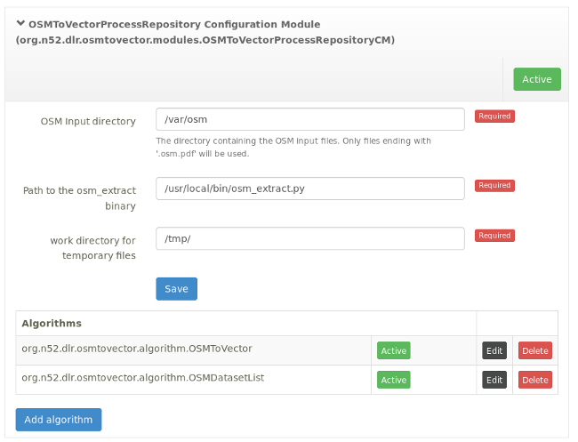

# osmtovector WPS process implementation

This repository contains a WPS process for the [52North/WPS](https://github.com/52North/WPS) to extract vector geo-data from OSM PBF files. 
These files can be obtained from the [geofabrik download server](https://download.geofabrik.de/).

This process creates its own process repository and allows the configuration via the webbased administation interface:

## Requirements

This section mostly describes the setup this software has been developed with, other versions may also work.

* Version 4.0.0 of [52North/WPS](https://github.com/52North/WPS) deployed in a Tomcat 8.
* tomcat should be running on Java 8. There are currently two issues which make it harder to use a newer java version:
    * There are currently some ServiceLoader issues with the version of geotools used by the WPS, caused by an API change in java 9.
      This issue is being resolved in geotools.
    * There are also issues with [jaxb](https://en.wikipedia.org/wiki/Java_Architecture_for_XML_Binding)
      not being bundled anymore with java starting with Java 9. jaxb is a requirement of the WPS server, but is
      currently not bundled with the WPS.
* Installed version of [dlr-eoc/osm-ogr-tools](https://github.com/dlr-eoc/osm-ogr-tools) + dependencies

## Installation

Build this software using

    mvn install

and copy the generated `target/osm-to-vector-X.X-SNAPSHOT-binaries/deploy-to-wps/osm-to-vector-X.X-SNAPSHOT.jar` to
the `WEB-INF/lib` directory of the WPS server.

After this you will have to modify the file WEB-INF/classes/dispatcher-servlet.xml. Change line 47 from

    <context:component-scan base-package="org.n52.wps">

to

    <context:component-scan base-package="org.n52">

After that a restart of the WPS server is required. Now the repository should be automatically added to the WPS configuration.

### Data preparation

After having downloaded the desired OSM PBF files it is recommended to reduce their size as 
much as possible for the intended use. This can be accomplished using the excellent 
[osmcode/osmium-tool](https://github.com/osmcode/osmium-tool). Example:

    # extracting only the road-data from a OSM file
    osmium tags-filter chile-latest.osm.pbf w/highway -o chile-latest.highway.osm.pbf

## Example WPS Excecute requests

See the `doc/requests` directory of this repository.

These XML files can be send to the WPS using `curl`:

    curl -X POST \
        -d @doc/requests/execute-dataset-list.xml \ 
        -H "Content-Type: text/xml" \
        http://localhost:8080/52n_wps_gt/WebProcessingService 
